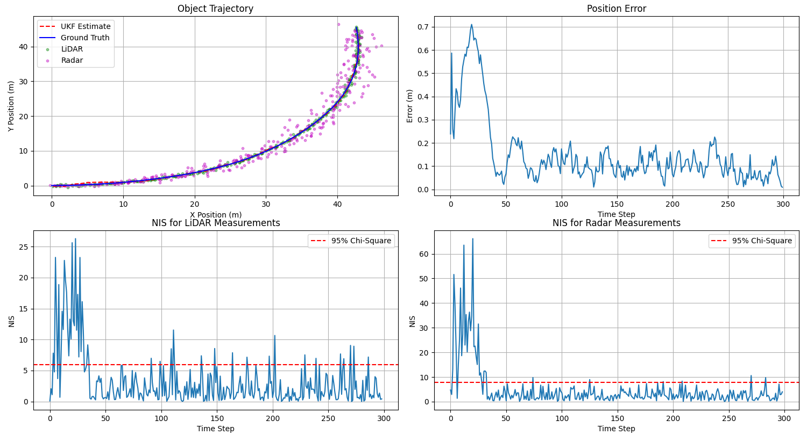

# Unscented Kalman Filter (UKF) for LiDAR and Radar Sensor Fusion

## Overview
This project implements an Unscented Kalman Filter (UKF) to fuse measurements from LiDAR and Radar sensors for tracking an object in 2D space. The UKF is designed to estimate the object's position, velocity, yaw angle, yaw rate, and acceleration.

## Features
- **State Vector**: Tracks position (\(px, py\)), velocity (\(v\)), yaw angle (\(yaw\)), yaw rate (\(yaw_{rate}\)), and acceleration (\(ax, ay\)).
- **Sensor Fusion**: Supports both LiDAR (position measurements) and Radar (range, angle, range rate measurements).
- **Noise Handling**: Configurable measurement noise parameters for LiDAR and Radar, as well as process noise for acceleration and yaw acceleration.
- **Sigma Points**: Generates sigma points for prediction and updates state using measurements.
- **Performance Metrics**:
  - Normalized Innovation Squared (NIS) values for consistency checks.
  - Position, velocity, and yaw angle error statistics.

## Components
1. **Unscented Kalman Filter Class**:
   - Handles prediction and update steps.
   - Includes methods for generating sigma points, predicting state mean/covariance, and updating with sensor measurements.
2. **Simulation**:
   - Generates test data for a vehicle moving in a curved trajectory.
   - Simulates sensor measurements with added noise.
   - Runs the UKF to estimate states based on simulated measurements.
3. **Visualization**:
   - Plots ground truth trajectory, estimated trajectory, LiDAR/Radar measurements, position error, and NIS values.
4. **Statistics**:
   - Calculates final and average errors in position, velocity, and yaw angle.
   - Evaluates NIS consistency for proper tuning of noise parameters.

## Usage
Run the simulation with default parameters:
python ukf_simulation.py

## Results
The simulation outputs:
- Ground truth vs UKF estimated trajectory.
- Position error over time.
- NIS values for both LiDAR and Radar measurements.

Object Trajectory Plot: Displays the ground truth trajectory, UKF-estimated trajectory, and sensor measurements (LiDAR and Radar) in 2D space.

Position Error Plot: Shows the error between the true position and the UKF-estimated position over time.

NIS for LiDAR Measurements: Plots the Normalized Innovation Squared (NIS) values for LiDAR measurements with a 95% chi-square threshold.

NIS for Radar Measurements: Plots the Normalized Innovation Squared (NIS) values for Radar measurements with a 95% chi-square threshold.

